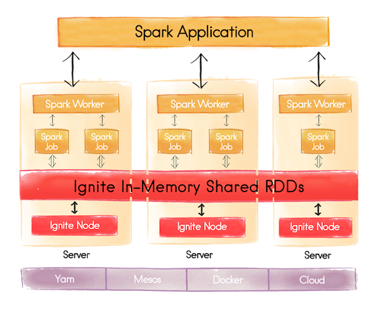

# Conclusion

## Take Away

- Compute / Data Grid for **scalability**

- Collocation / Transaction for **operational systems**

- Grid toolbox

## Use Cases

- In-Memory platform / toolbox

- Scalability / Elasticity / Partitioning

- Complex Searches

### SQL Grid

### In-Memory File System (IGFS)

Hadoop FileSystem or Hadoop FileSystem Cache.

## Spark RDD

IgniteRDD as in-memory shared Spark RDDs.

## Thank You !

> Q/A &amp; Questions
